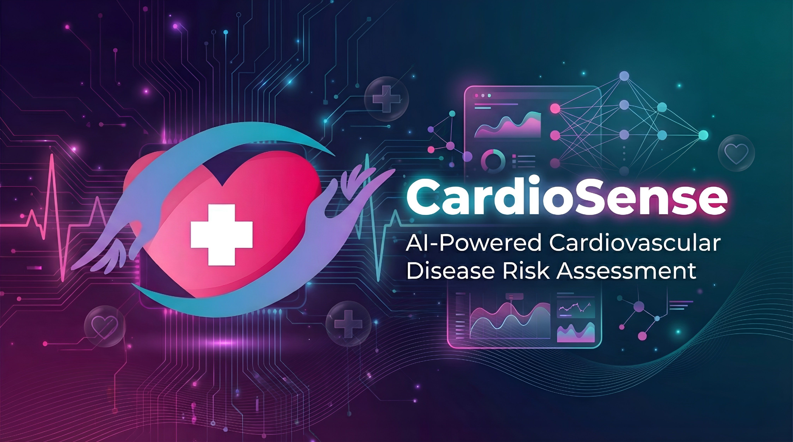

<div align="center">

  
  
  # CardioSense
  ### AI-Powered Cardiovascular Disease Risk Assessment

  [](https://www.python.org/)
  [](https://flask.palletsprojects.com/)
  [](https://scikit-learn.org/)
  [](https://xgboost.readthedocs.io/)
  [](https://getbootstrap.com/)
  [](LICENSE)

  

</div>

---


## 🚀 Overview
Cardiovascular diseases (CVDs) are the leading cause of death globally. Early detection is critical, but traditional methods can be slow and subjective.

**CardioSense** is a comprehensive Machine Learning web application designed to predict the presence of cardiovascular disease. It processes 12 key patient health metrics-including Age, Gender, Blood Pressure, and Cholesterol-through an advanced **Voting Ensemble Model** to provide an instant, accurate risk assessment.

Unlike black-box AI tools, CardioSense provides **explainable insights**, helping both patients understand their risk and doctors visualize the contributing factors.

---

## ✨ Key Features
* **🩺 Interactive Patient Wizard:** A user-friendly, step-by-step form to collect health data without overwhelming the user.
* **⚡ Real-Time Validation:** Instant feedback on impossible medical values (e.g., BP > 250 or < 30) ensures high-quality input data.
* **📊 Doctor Dashboard:** A dedicated analytics page showing Model Accuracy, ROC Curves, Confusion Matrix, and Feature Importance charts.
* **🧠 Intelligent Backend:** Calculates advanced derived features like **Pulse Pressure** and **BMI Categories** on the fly.
* **📱 Responsive Design:** Fully optimized for mobile, tablet, and desktop using Bootstrap 5.
* **📄 PDF Report Ready:** Includes print-optimized styles for generating patient reports.

---

## 🛠️ Tech Stack
| Category | Technologies |
| :--- | :--- |
| **Frontend** | HTML5, CSS3, JavaScript (ES6), Bootstrap 5, Chart.js |
| **Backend** | Python 3.10, Flask, Jinja2, Gunicorn |
| **Machine Learning** | Scikit-Learn, XGBoost, Pandas, NumPy, Joblib |
| **Data Processing** | Standard Scaling, One-Hot Encoding, Feature Engineering |
| **Deployment** | Render / Railway, Git |

---

## 🧠 Machine Learning Architecture
The core intelligence of CardioSense is built upon a rigorous data science pipeline:

### 1. Data Processing
* **Dataset:** [Kaggle Cardiovascular Disease Dataset](https://www.kaggle.com/sulianova/cardiovascular-disease-dataset) (~70,000 records).
* **Cleaning:** Removal of duplicates and medically impossible outliers (e.g., Diastolic BP > Systolic BP).
* **Feature Engineering:**
    * `Pulse Pressure`: Calculated as (Systolic - Diastolic).
    * `BMI`: Calculated from Height and Weight.
* **Scaling:** All numerical features are normalized using `StandardScaler` to ensure model stability.

### 2. The "Avengers" Ensemble
Instead of relying on a single algorithm, CardioSense employs a **Voting Classifier** (Soft Voting) that combines the strengths of three powerful models:
1.  **Random Forest:** Excellent for capturing non-linear relationships.
2.  **XGBoost:** The industry standard for gradient boosting performance.
3.  **Gradient Boosting:** Adds robustness to the ensemble.
4.  *(Baseline)* **Logistic Regression:** Provides probability calibration stability.

---

## 📊 Model Performance
We benchmarked our custom "Scratch" implementation against industry-standard libraries.

| Model Architecture | Accuracy | F1-Score | Status |
| :--- | :--- | :--- | :--- |
| **Voting Ensemble (RF + XGB + GB)** | **73.0%** | **0.72** | 🏆 **Selected** |
| Random Forest (Optimized) | 72.7% | 0.71 | Runner Up |
| XGBoost (Tuned) | 72.5% | 0.71 | Strong |
| Logistic Regression (Sklearn) | 72.4% | 0.70 | Baseline |
| Logistic Regression (From Scratch) | 72.2% | 0.69 | Validated |

> *Note: While ~73% may seem modest, medical datasets are inherently noisy. This score represents the state-of-the-art for this specific dataset without overfitting.*

---

## 📂 Folder Structure
```bash
CardioSense/
├── 📂 data/                # Raw and processed datasets
├── 📂 deployment/          # Cloud configuration (Procfile, requirements.txt)
├── 📂 flask_app/           # Main Application Code
│   ├── 📂 static/          # CSS, JS, Images
│   ├── 📂 templates/       # HTML Pages (index.html, model.html)
│   ├── app.py              # Flask Backend
│   ├── model.pkl           # Trained Ensemble Model
│   ├── scaler.pkl          # Feature Scaler
│   └── features.pkl        # Feature Names List
├── 📂 notebooks/           # Jupyter Notebooks for EDA & Training
├── .gitignore
├── LICENSE
└── README.md
```

## ⚡ Installation & Local Setup

### Prerequisites

  * Python 3.10+
  * Git

### Steps

1.  **Clone the Repository**

    ```bash
    git clone [https://github.com/YourUsername/CardioSense.git](https://github.com/YourUsername/CardioSense.git)
    cd CardioSense
    ```

2.  **Create a Virtual Environment**

    ```bash
    # Windows
    python -m venv venv
    venv\Scripts\activate

    # Mac/Linux
    python3 -m venv venv
    source venv/bin/activate
    ```

3.  **Install Dependencies**

    ```bash
    pip install -r deployment/requirements.txt
    ```

4.  **Run the Application**

    ```bash
    python flask_app/app.py
    ```

5.  **Access the App**
    Open your browser and navigate to `http://127.0.0.1:5000/`.

-----

## 🖥️ UI Walkthrough

| **1. Assessment Wizard** | **2. Risk Result** |
| :---: | :---: |
|  |  |
| *Step-by-step data collection with live BMI calculation.* | *Clear risk probability with actionable health tips.* |

| **3. Doctor Dashboard** | **4. Feature Importance** |
| :---: | :---: |
|  |  |
| *Comprehensive metrics (ROC, Confusion Matrix).* | *Explainable AI showing top risk factors.* |

-----

## 🌐 Deployment

This project is configured for seamless deployment on **Render**.

1.  Push your code to GitHub.
2.  Create a new **Web Service** on Render.
3.  Connect your repository.
4.  Use the following settings:
      * **Build Command:** `pip install -r deployment/requirements.txt`
      * **Start Command:** `gunicorn --chdir flask_app app:app`

-----

## 🔮 Future Scope

  * **Deep Learning:** Integrate Neural Networks (ANN/CNN) for potentially higher accuracy.
  * **Wearable Sync:** Allow direct data import from Apple Watch/Fitbit APIs.
  * **Multi-Language Support:** Expand access to non-English speakers.
  * **User Accounts:** Save patient history for longitudinal risk tracking.

-----

## 📜 License

This project is licensed under the [MIT License](https://www.google.com/search?q=LICENSE).

<br>
<div align="center">
  <b>Developed with 💖 by ¥@$# Kakadiya</b>
</div>